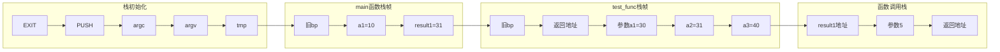
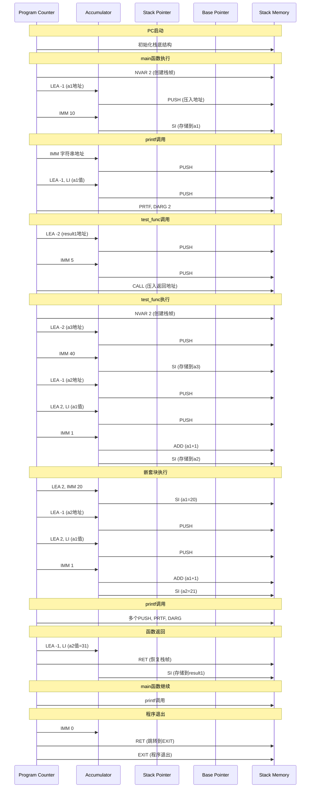

# CPC编译器执行流程图

## 📊 完整执行流程

```mermaid
graph TD
    A[PC启动: 5369791360] --> B[run_vm初始化栈]
    B --> C[栈底: EXIT, PUSH, argc, argv, tmp]
    
    C --> D[main函数: NVAR 2]
    D --> E[创建栈帧: 旧bp, a1, result1]
    
    E --> F[a1 = 10]
    F --> G[LEA-1 PUSH IMM10 SI]
    G --> H[a1 = 10 完成]
    
    H --> I[printf调用]
    I --> J[IMM字符串地址 PUSH LEA-1 LI PUSH PRTF DARG2]
    J --> K[输出main a1=10]
    
    K --> L[result1 = test_func 5]
    L --> M[LEA-2 PUSH IMM5 PUSH CALL 5369790472]
    M --> N[压入返回地址]
    
    N --> O[test_func: NVAR 2]
    O --> P[创建test_func栈帧]
    P --> Q[栈帧: 旧bp, 返回地址, 参数a1=5, a2, a3]
    
    Q --> R[a3 = 40]
    R --> S[LEA-2 PUSH IMM40 SI]
    S --> T[a3 = 40 完成]
    
    T --> U[a2 = a1 + 1]
    U --> V[LEA-1 PUSH LEA2 LI PUSH IMM1 ADD SI]
    V --> W[a2 = 6 完成]
    
    W --> X[嵌套块 a1 = 20]
    X --> Y[LEA2 PUSH IMM20 SI]
    Y --> Z[a1 = 20 完成]
    
    Z --> AA[a2 = a1 + 1]
    AA --> BB[LEA-1 PUSH LEA2 LI PUSH IMM1 ADD SI]
    BB --> CC[a2 = 21 完成]
    
    CC --> DD[printf inner a1=20 a2=21 a3=40]
    DD --> EE[内层嵌套 a1 = 30]
    EE --> FF[a2 = a1 + 1]
    FF --> GG[a2 = 31 完成]
    
    GG --> HH[printf inner a1=30 a2=31 a3=40]
    HH --> II[printf outer a1=30 a2=31 a3=40]
    
    II --> JJ[return a2]
    JJ --> KK[LEA-1 LI RET]
    KK --> LL[ax = 31]
    
    LL --> MM[RET执行]
    MM --> NN[sp=bp bp=旧bp pc=返回地址]
    
    NN --> OO[返回到main函数]
    OO --> PP[DARG1 清理参数]
    PP --> QQ[SI result1 = 31]
    
    QQ --> RR[printf Results result1=31]
    RR --> SS[printf a1=10]
    
    SS --> TT[return 0]
    TT --> UU[IMM0 RET]
    UU --> VV[ax = 0]
    
    VV --> WW[main函数RET执行]
    WW --> XX[pc跳转到栈底EXIT指令]
    
    XX --> YY[EXIT指令执行]
    YY --> ZZ[输出exit 0]
    ZZ --> END[程序退出]
    
    style A fill:#e1f5fe
    style B fill:#e8f5e8
    style C fill:#e8f5e8
    style D fill:#fff3e0
    style E fill:#fff3e0
    style F fill:#fff3e0
    style G fill:#fff3e0
    style H fill:#e8f5e8
    style I fill:#fff3e0
    style J fill:#fff3e0
    style K fill:#e8f5e8
    style L fill:#fff3e0
    style M fill:#fff3e0
    style N fill:#fff3e0
    style O fill:#f3e5f5
    style P fill:#f3e5f5
    style Q fill:#f3e5f5
    style R fill:#f3e5f5
    style S fill:#f3e5f5
    style T fill:#e8f5e8
    style U fill:#f3e5f5
    style V fill:#f3e5f5
    style W fill:#e8f5e8
    style X fill:#f3e5f5
    style Y fill:#f3e5f5
    style Z fill:#e8f5e8
    style AA fill:#f3e5f5
    style BB fill:#f3e5f5
    style CC fill:#e8f5e8
    style DD fill:#e8f5e8
    style EE fill:#f3e5f5
    style FF fill:#f3e5f5
    style GG fill:#e8f5e8
    style HH fill:#e8f5e8
    style II fill:#e8f5e8
    style JJ fill:#f3e5f5
    style KK fill:#f3e5f5
    style LL fill:#e8f5e8
    style MM fill:#f3e5f5
    style NN fill:#f3e5f5
    style OO fill:#fff3e0
    style PP fill:#fff3e0
    style QQ fill:#e8f5e8
    style RR fill:#e8f5e8
    style SS fill:#e8f5e8
    style TT fill:#fff3e0
    style UU fill:#fff3e0
    style VV fill:#e8f5e8
    style WW fill:#fff3e0
    style XX fill:#fff3e0
    style YY fill:#ffebee
    style ZZ fill:#ffebee
    style END fill:#ffebee
```

## 🎯 栈状态变化图

## 🔄 指令执行时序图

## 📊 内存布局图

```mermaid
graph TB
    subgraph "代码段 (动态分配)"
        A1[test_func: 5369790472]
        A2[main: 5369791360]
        A3[字符串常量: 5370839056]
    end
    
    subgraph "数据段 (0x2000)"
        B1[全局变量a1: 0x2000]
        B2[全局变量a3: 0x2008]
    end
    
    subgraph "栈段 (高地址到低地址)"
        C1[EXIT指令]
        C2[PUSH指令]
        C3[argc参数]
        C4[argv参数]
        C5[tmp指针]
        C6[main栈帧]
        C7[test_func栈帧]
        C8[函数调用栈]
    end
    
    A1 --> A2
    A2 --> A3
    B1 --> B2
    C1 --> C2
    C2 --> C3
    C3 --> C4
    C4 --> C5
    C5 --> C6
    C6 --> C7
    C7 --> C8
```

## 🎨 颜色说明

- 🔵 **蓝色**: PC启动和初始化
- 🟢 **绿色**: 成功执行和输出
- 🟠 **橙色**: main函数相关操作
- 🟣 **紫色**: test_func函数相关操作
- 🔴 **红色**: 程序退出相关操作

## 📝 使用说明

1. **复制Mermaid代码**到支持Mermaid的编辑器（如Typora、VS Code、GitHub等）
2. **查看流程图**了解完整的执行过程
3. **参考时序图**理解指令执行的详细步骤
4. **查看内存布局**了解程序的内存结构

这些图表完整展示了CPC编译器从启动到退出的整个过程！
