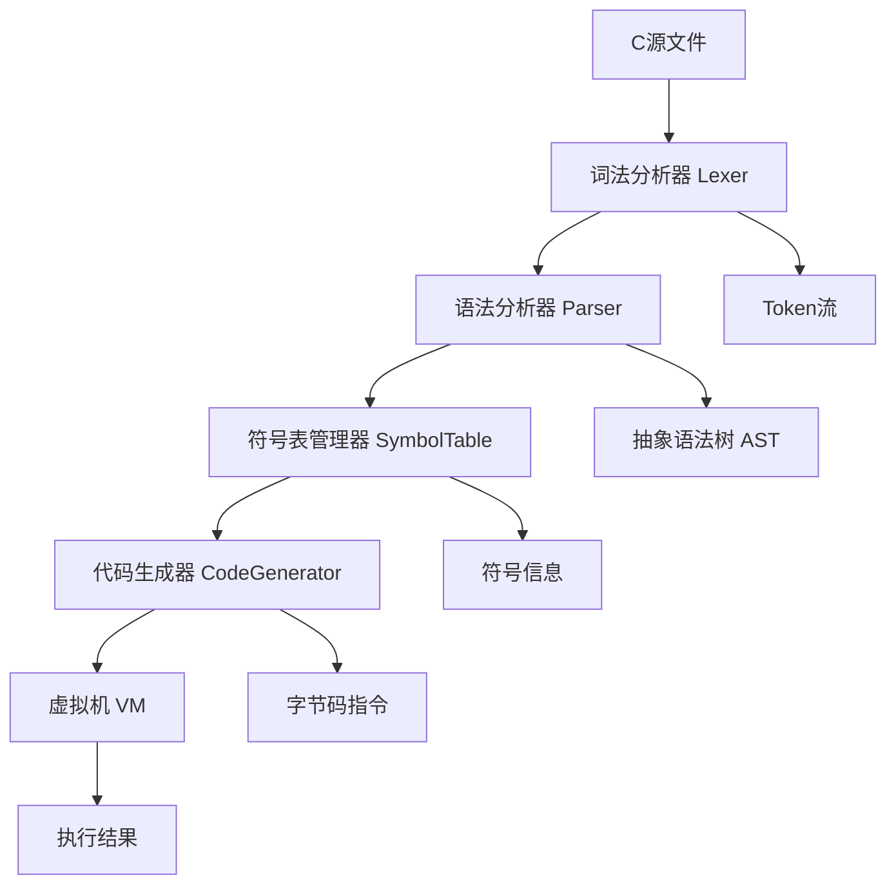

# TypeScript版CPC编译器实现计划

## 项目目标
使用TypeScript复刻C语言编译器，实现从C源码到虚拟机指令的完整编译流程。

## 整体架构



## 模块设计

### 1. 词法分析器 (Lexer)
**功能**: 将C源代码转换为Token序列
**核心类**: `Lexer`
**主要方法**:
- `nextToken()`: 获取下一个Token
- `peekToken()`: 预览下一个Token
- `skipWhitespace()`: 跳过空白字符
- `parseIdentifier()`: 解析标识符
- `parseNumber()`: 解析数字常量
- `parseString()`: 解析字符串常量

### 2. 语法分析器 (Parser)
**功能**: 根据语法规则构建抽象语法树
**核心类**: `Parser`
**主要方法**:
- `parse()`: 主解析函数
- `parseDeclaration()`: 解析变量/函数声明
- `parseStatement()`: 解析语句
- `parseExpression()`: 解析表达式
- `parseFunction()`: 解析函数定义

### 3. 符号表管理器 (SymbolTable)
**功能**: 管理变量、函数等符号信息
**核心类**: `SymbolTable`, `Symbol`
**主要方法**:
- `addSymbol()`: 添加符号
- `lookupSymbol()`: 查找符号
- `enterScope()`: 进入作用域
- `exitScope()`: 退出作用域

### 4. 代码生成器 (CodeGenerator)
**功能**: 生成虚拟机指令
**核心类**: `CodeGenerator`
**主要方法**:
- `generate()`: 生成代码
- `emit()`: 发射指令
- `allocateMemory()`: 分配内存

### 5. 虚拟机 (VM)
**功能**: 执行生成的指令
**核心类**: `VirtualMachine`
**主要方法**:
- `execute()`: 执行指令
- `push()`: 压栈
- `pop()`: 出栈
- `call()`: 函数调用

## 实现步骤

### 第一阶段：基础架构
1. 创建项目结构和TypeScript配置
2. 实现基础数据类型和常量定义
3. 创建Token类型和指令集定义

### 第二阶段：词法分析
1. 实现Lexer类
2. 支持基本Token识别
3. 添加错误处理机制

### 第三阶段：语法分析
1. 实现Parser类
2. 支持变量声明和简单表达式
3. 构建AST数据结构

### 第四阶段：符号表管理
1. 实现SymbolTable类
2. 支持作用域管理
3. 实现变量遮蔽机制

### 第五阶段：代码生成
1. 实现CodeGenerator类
2. 生成基本指令序列
3. 支持函数调用和返回

### 第六阶段：虚拟机
1. 实现VirtualMachine类
2. 支持指令执行
3. 添加调试功能

## 文件结构

```
src/
├── compiler/
│   ├── lexer.ts          # 词法分析器
│   ├── parser.ts         # 语法分析器
│   ├── symbol-table.ts   # 符号表管理
│   ├── code-generator.ts  # 代码生成器
│   └── vm.ts             # 虚拟机
├── types/
│   ├── tokens.ts         # Token类型定义
│   ├── instructions.ts   # 指令集定义
│   └── ast.ts            # AST节点类型
├── utils/
│   ├── error-handler.ts  # 错误处理
│   └── logger.ts         # 日志工具
└── main.ts               # 主入口文件
```

## 测试策略

1. **单元测试**: 每个模块独立测试
2. **集成测试**: 模块间协作测试
3. **端到端测试**: 完整编译流程测试
4. **性能测试**: 编译速度和内存使用测试

## 预期成果

- 完整的TypeScript版C语言编译器
- 支持基本的C语言语法特性
- 可执行的虚拟机环境
- 丰富的测试用例和文档
- 良好的错误提示和调试功能